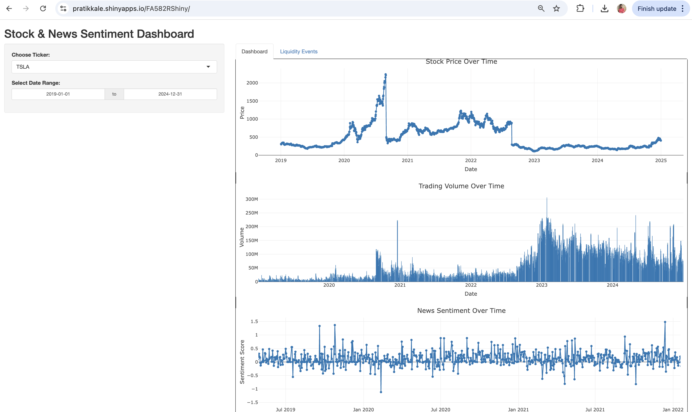
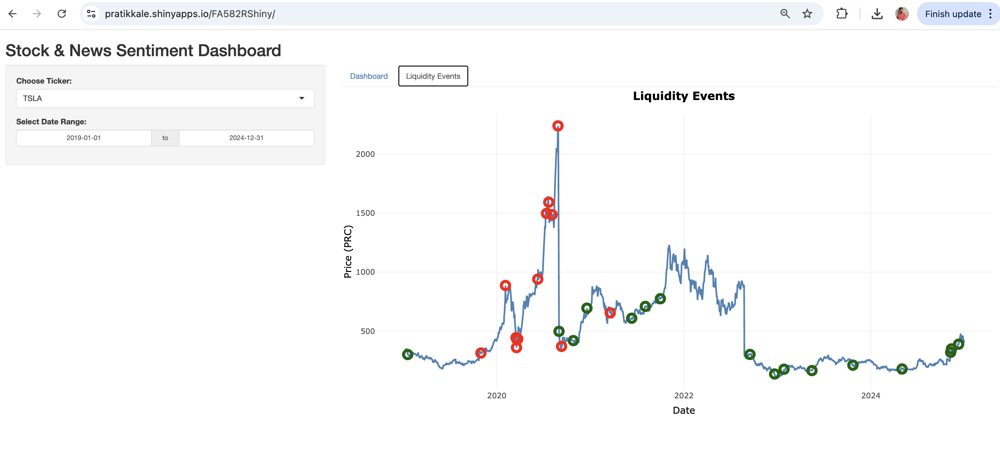

# Detecting Rare Events in Low Frequency Financial Data

This project investigates techniques to detect rare or anomalous events in low-frequency financial time series data. It uses statistical modeling, feature engineering, and visualization to identify market shifts or outliers that could signal important underlying changes.

## Objective

To develop a pipeline that identifies and interprets anomalies in weekly or monthly financial data, which is often sparse and harder to analyze compared to high-frequency datasets.

## Project Components

- **Data Cleaning and Preprocessing:** Handling missing values, standardizing time series formats
- **Exploratory Data Analysis (EDA):** Visual inspection, distribution analysis, time plots
- **Rare Event Detection:** Using z-scores, thresholds, and time series anomalies
- **Modeling:** Basic forecasting methods and pattern recognition
- **Shiny App Dashboard:** For interactive visualization and scenario testing

## Shiny App Link and Screenshots

#### https://pratikkale.shinyapps.io/FA582RShiny/





## Directory Structure

```
project-root/
├── Code/
│   ├── Main Project Code/
│   │   ├── Final Project EDA.R
│   │   └── Project Final.R
│   └── RShiny/                
└── Datasets/
    └── Raw and Cleaned CSVs

```

## Technologies Used

- **Language:** R
- **Libraries:** dplyr, ggplot2, forecast, lubridate, shiny, tseries
- **Tools:** RStudio, R Shiny

## How to Run

To run the R scripts:
```r
source("Code/Main Project Code/Final Project EDA.R")
source("Code/Main Project Code/Project Final.R")
```

To launch the dashboard:
```r
shiny::runApp("Code/RShiny/")
```

## Use Cases

- Monitoring rare market shifts
- Early warning system for portfolio managers
- Detecting economic stress points in low-frequency macro data

## Authors

Group 3 – FA582  
Stevens Institute of Technology, Spring 2025

## License

This project is intended for academic and educational use only.
